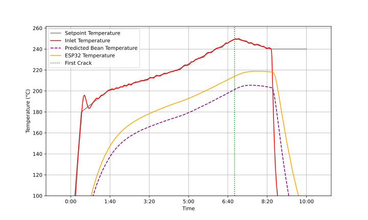

# libikawa

> [!WARNING]
> This library is in very early development, use at your own risk.

*libikawa* is an open-source library that implements the communication protocol of the [Ikawa Home roaster](https://ikawahome.com/). Aimed at enabling developers and coffee enthusiasts alike to create custom tools and interfaces, this project offers the foundation for both extending and replacing the standard app-based interactions with the Ikawa Home roaster.

## Usage

Refer to the [example code](example.py) for a basic guide on how to integrate and use libIkawa within your projects. This sample illustrates the fundamental steps to communicate with the Ikawa Home, leveraging the library's capabilities.[^1]

The library also comes with a basic PoC [CLI tool](cli.py) to control the roaster and a [Plotting tool](plot_log.py) to visually display the logs generated by the CLI when running `./cli.py log`.

### Example plot

> [!NOTE]
> This plot combines measurements from the Ikawa Home with additional measurments from a custom build [ESP32-C3 PT1000 BLE temperature probe](https://github.com/nkraetzschmar/esp32-c3-pt1000).

## Technical Details

The creation of libIkawa was motivated by the desire for a more versatile approach to interacting with the Ikawa Home roaster, beyond the limitations of the official app. The library is the result of reverse engineering the roaster's communication protocol, significantly aided by the prior work of [esteveespuna](https://github.com/esteveespuna/IkawaRoasterEmulator).

For a detailed account of the communication protocol and the findings from the reverse engineering process, please refer to the [Ikawa Home Roaster Protocol Analysis](ikawa_protocol.md).

[^1]: **TODO:** provide real documentation
